# 🍽 МИФУД

Веб-приложение для студентов: предзаказ еды в столовой и бронирование столов.

---

## 📋 Оглавление
- [О проекте](#-о-проекте)
- [Функционал](#%EF%B8%8F-функционал)
- [Стек технологий](#-стек-технологий)
- [Схема базы данных](#%EF%B8%8F-схема-базы-данных)
- [Быстрый старт](#-быстрый-старт)
- [Тестовые аккаунты](#-тестовые-аккаунты)
- [Скриншоты](#-скриншоты)
  
---

## 📖 О проекте

**Цель:** Автоматизация процесса заказа еды и бронирования столов для снижения очередей в часы пик и оптимизации загрузки посадочных мест.

**Бизнес-задачи:**
- Сокращение времени ожидания заказа для студента
- Прогнозирование загрузки кухни
- Учёт занятости столов в реальном времени

---

## ⚙️ Функционал

### 👤 Для клиента (Студент / Сотрудник)

| Возможность | Статус | Примечание |
| :--- | :---: | :--- |
| Регистрация и авторизация | ✅ | С проверкой на уникальность email |
| Просмотр меню на день | ✅ | С категориями, ценами и фото |
| Добавление блюд в корзину | ✅ | С выбором даты и времени получения |
| Бронирование столика | ✅ | Выбор продолжительности бронирования и номера стола |
| Проверка занятости стола | ✅ | Система не даёт двойное бронирование |
| Личный кабинет | ✅ | История заказов и бронирований |

### 🔧 Для администратора (Столовая)

| Возможность | Статус | Примечание |
| :--- | :---: | :--- |
| Управление меню | ✅ | Добавление / Изменение / Удаление блюд |
| Просмотр очереди заказов | ✅ | С фильтром по статусу готовности |
| Подтверждение брони | ✅ | Админ видит все брони на день |
| Смена статуса заказа | ✅ | «Ожидает подтверждения» / «Принят в работу» / «Готов к выдаче» / «Получен клиентом» / «Отменён» |

---

## 🛠 Стек технологий


| Инструмент       | Зачем                              |
|------------------|------------------------------------|
| Flask            | Веб-фреймворк                      |
| Flask-SQLAlchemy | ORM — работа с базой данных        |
| Flask-Migrate    | Миграции БД                        |
| Flask-Login      | Авторизация пользователей          |
| Bootstrap 5      | UI                                 |
| HTMX             | Динамика без тяжёлого JS           |

---

## 🗄️ Схема базы данных

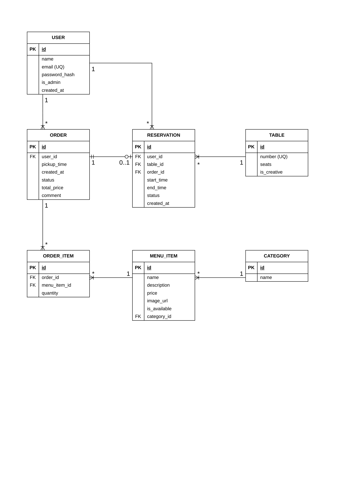

---

## 🚀 Быстрый старт

```bash
# 1. Создать виртуальное окружение
python -m venv venv
source venv/bin/activate        # macOS/Linux
# venv\Scripts\activate         # Windows

# 2. Установить зависимости
pip install -e ".[dev]"

# 3. Настроить переменные окружения
cp .env.example .env
# Открой .env и поменяй SECRET_KEY

# 4. Инициализировать базу данных
flask db init
flask db migrate -m "initial"
flask db upgrade

# 5. Запустить
flask run
```

## Запуск тестов

```bash
pytest
```

---

## 🔑 Тестовые аккаунты

| Роль | Email (Логин) | Пароль | Примечание |
| :--- | :--- | :--- | :--- |
| 👑 Администратор | `admin@mifi.ru` | `password` | Полный доступ к панели управления |
| 👤 Студент / Сотрудник | `ivan@mifi.ru` | `password` | Может заказывать еду и бронировать столы |

---

## 📸 Скриншоты

| Вход в аккаунт | Регистрация |
| :---: | :---: |
| 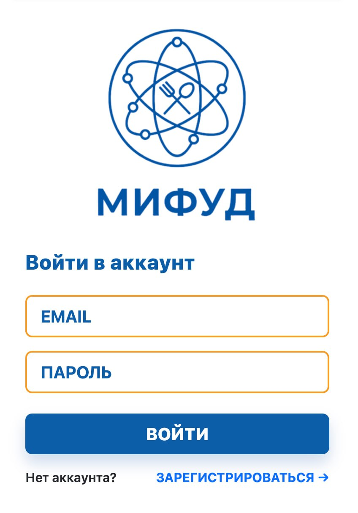 | 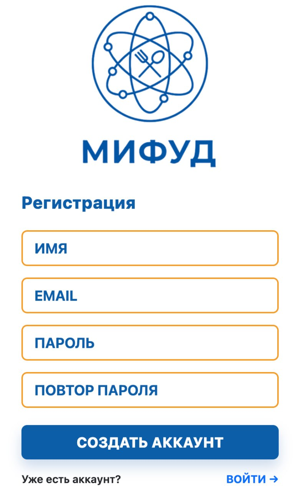 |

### 🏠 Клиентская часть

### Меню
| | | |
| :---: | :---: | :---: |
| 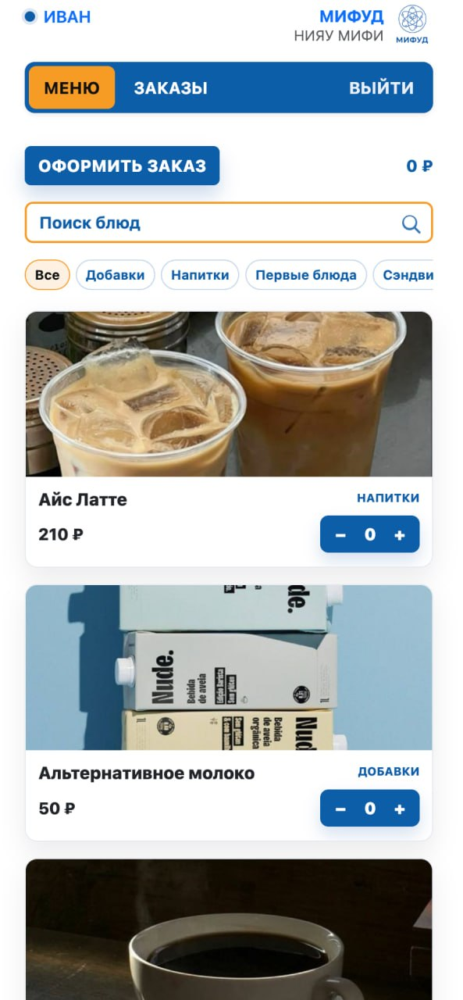 | 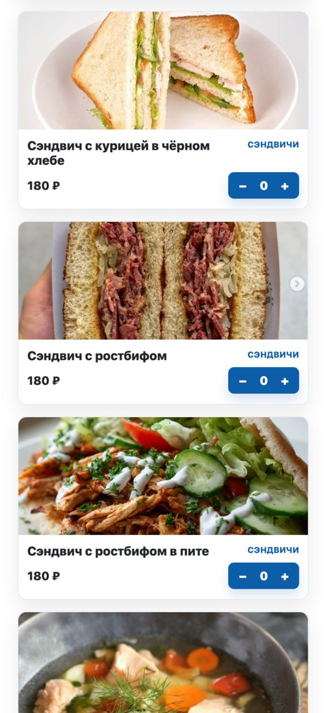 | 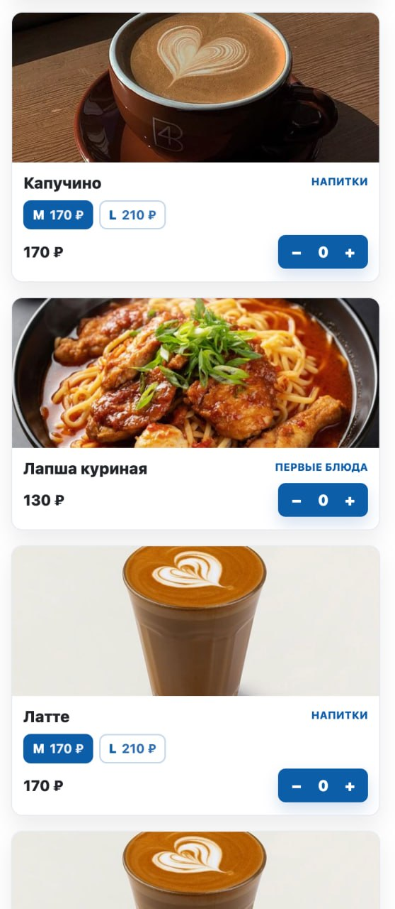 |

### Оформление заказа
| | | |
| :---: | :---: | :---: |
| 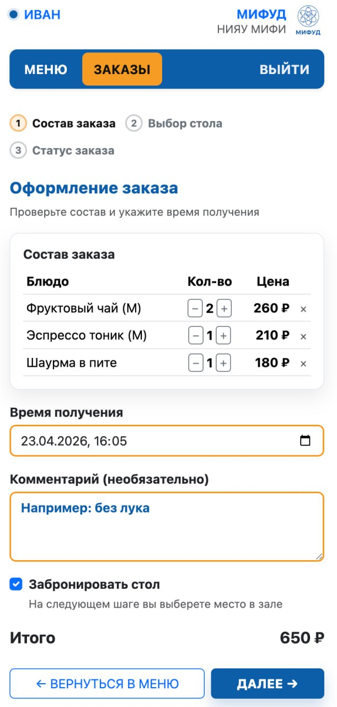 | 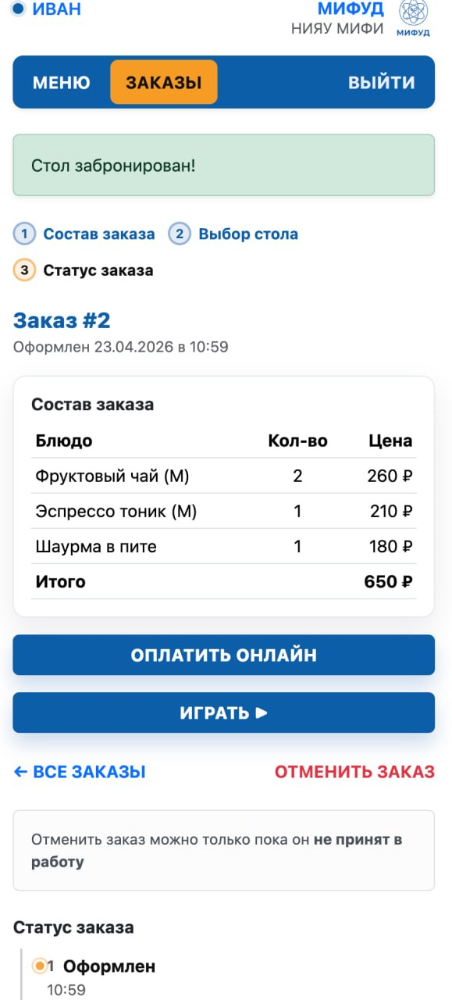 | 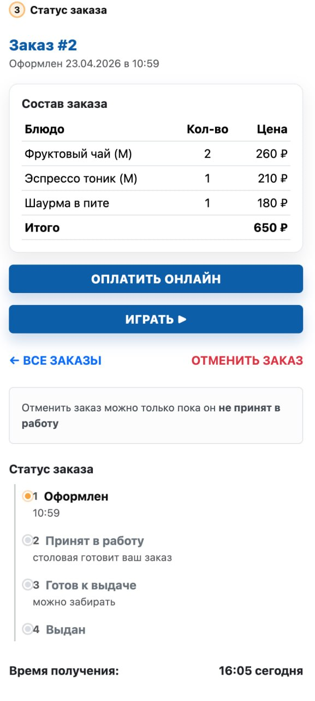 |

### Выбор стола
| | |
| :---: | :---: |
| 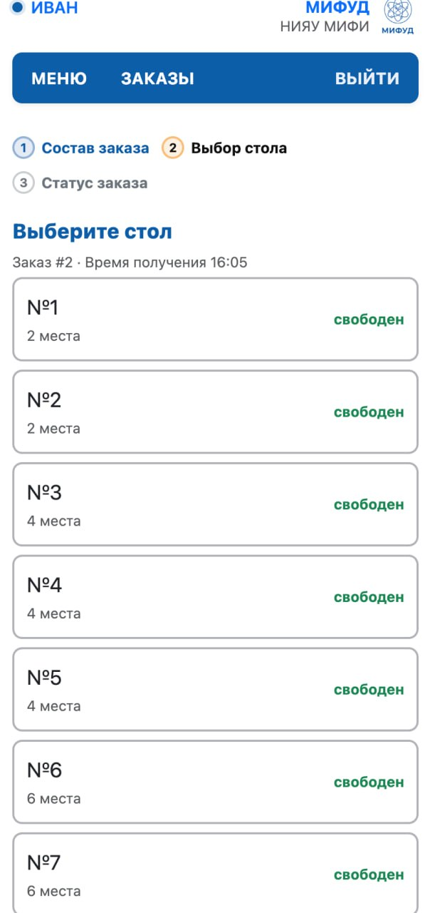 | 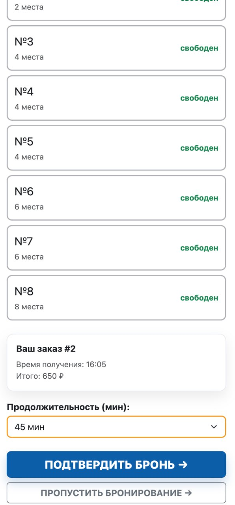 |

### Мои заказы

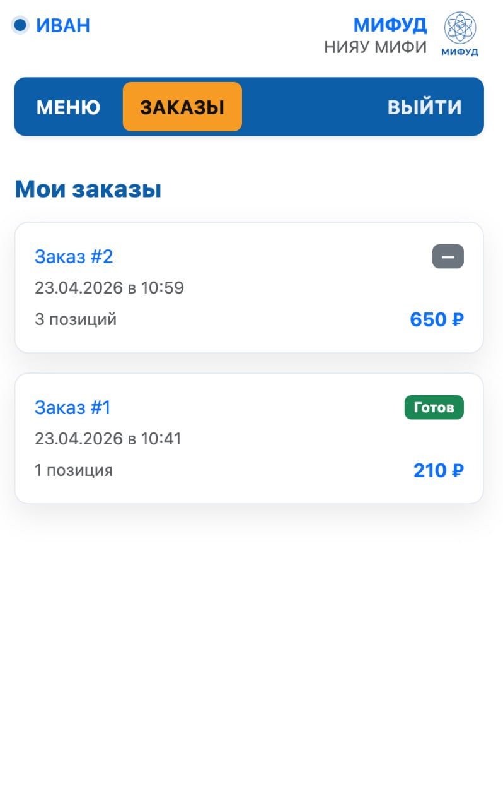

### 🔧 Панель администратора

| Управление заказами | Управление меню | Управление столами |
| :---: | :---: | :---: |
| 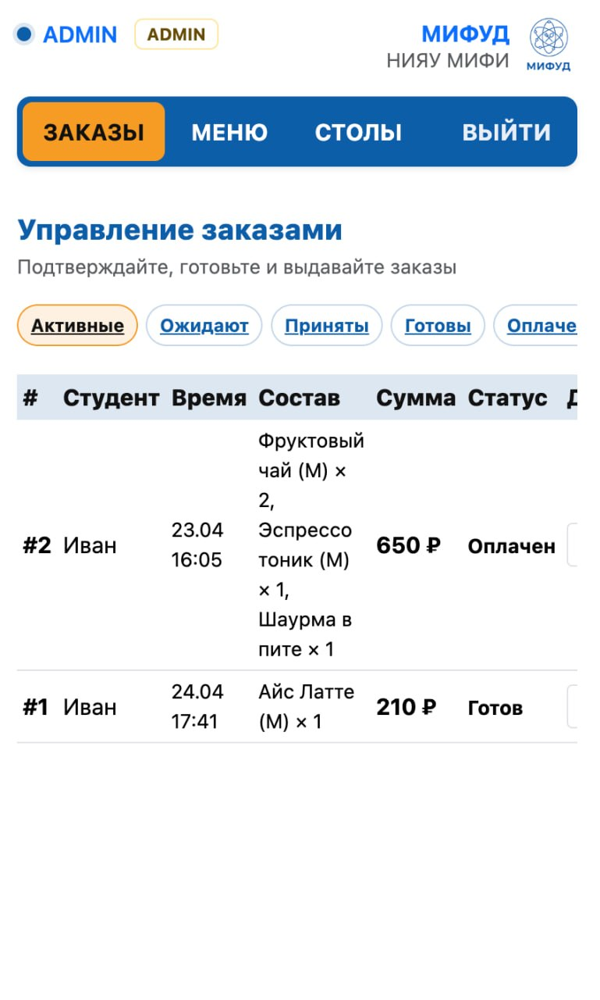 | 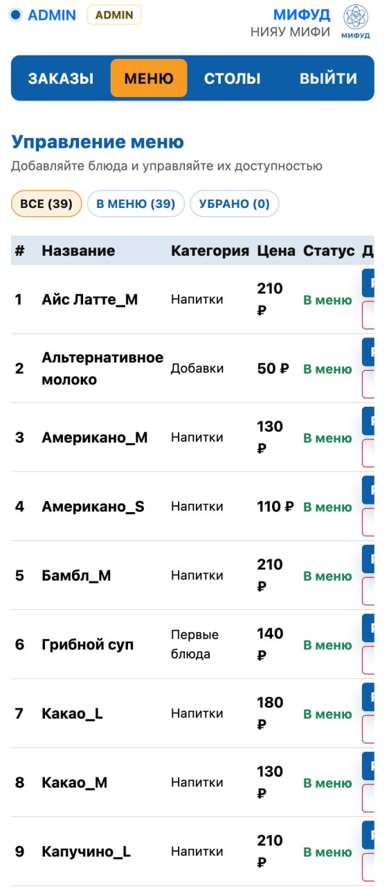 | 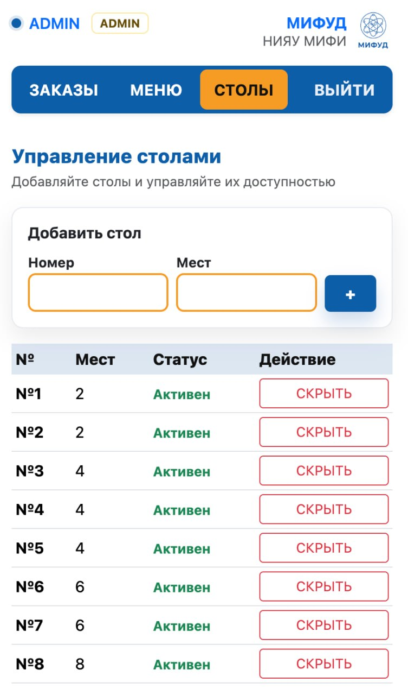 |
